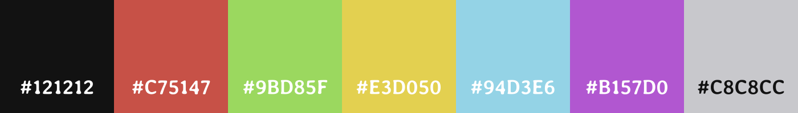

    <h1>colorscheme</h1>

---

This repo is central point for my colorscheme.

# Table of contents

- [Color Reference](#Color-Reference)
- [Primary Colors](#Primary-Colors)
- [Other Colors](#Other-Colors)
- [Example Configs](#Examples)
- [Plans](#Plans)

# Color Reference

# Primary Colors

## Black
- `#121212` - background
- `#242424` - brighter background

## White
- `#F5F5FA` - white, too bright for dark themes.
- `#C8C8CC` - white, perfect for darker themes.
- `#AAAAAD` - dark white

## Red
- `#C75147` - "satured dust red"
- `#662A25` - "dark clay red"

## Orange
- `#D99E64` - "dust orange"
- `#B88654` - "dark dust orange"

## Yellow
- `#D4B85D` - "goldish yellow"
- `#B39B4F` - "dark goldish yellow"

## Magenta
- `#B157D0` - "violet"
- `#713885` - "dark violet"

## Green (partially)
- `#8DBF67` - "grass-like green"

# Other Colors

These are colors that are good to have.

## Green
- `#9BD85F` - "light grass-like green"
- `#8DBF67` - "grass-like green"

## Cyan
- `#91FFE9` - "greenish sky-like blue"
- `#71C7B6` - "dark greenish sky-like blue"

## Blue
- `#94D3E6` - "sky-like blue"
- `#6F9FAD` - "dark sky-like blue"

---

# Examples

- [neovim](nvim)
- [alacritty](alacritty)
- [wallpapers](https://github.com/Matissoss/mateus-wallpapers)

# Contributing

If you want to submit your own theme for any CLI/program, create an Issue and I'll try to add that ASAP.

# Plans

I plan to make colorscheme for light theme and add more configurations.

# Credits

made by matissoss

licensed under MIT
